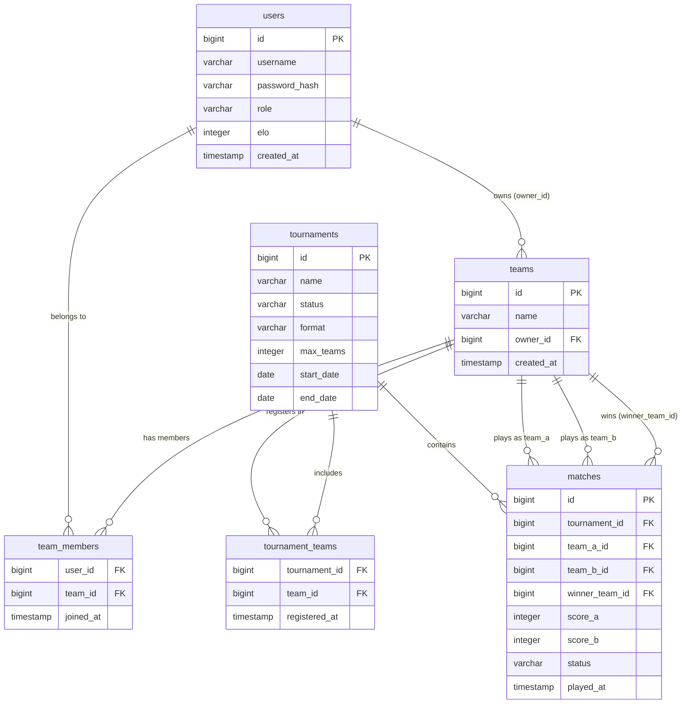

# Requirements: Tournament Platform — Database Schema & Django REST API Foundation

## Purpose
Design a normalized relational database schema for a tournament management platform and expose it through a Django REST API. The schema must support user management with ELO ranking, team organization, tournament lifecycle, and match tracking with score recording.

## Scope
- **In scope:**
  - Six database tables: `users`, `teams`, `team_members`, `tournaments`, `tournament_teams`, `matches`
  - All indexes, constraints, and foreign key rules specified below
  - An entity-relationship diagram in Markdown (Mermaid syntax)
  - Django models and initial migrations
  - A minimal Django REST API skeleton (models + serializers + router registration)
- **Out of scope:**
  - Authentication/authorization endpoints (login, JWT, sessions)
  - ELO recalculation logic or business rules
  - Tournament bracket generation algorithms
  - Frontend or UI
  - Deployment configuration

---

## Requirements

### Users Table (`users`)
1. Table name: `users`
2. Fields:

| Column          | Type         | Constraints                              |
|-----------------|--------------|------------------------------------------|
| `id`            | BIGINT (PK)  | Auto-increment, primary key              |
| `username`      | VARCHAR(150) | NOT NULL, UNIQUE                         |
| `password_hash` | VARCHAR(255) | NOT NULL                                 |
| `role`          | VARCHAR(10)  | NOT NULL, CHECK IN (`admin`, `player`)   |
| `elo`           | INTEGER      | NOT NULL, DEFAULT 1000                   |
| `created_at`    | TIMESTAMP    | NOT NULL, DEFAULT now()                  |

3. Index on `users.elo` (descending) for ranking queries.

---

### Teams Table (`teams`)
4. Table name: `teams`
5. Fields:

| Column       | Type         | Constraints                                      |
|--------------|--------------|--------------------------------------------------|
| `id`         | BIGINT (PK)  | Auto-increment, primary key                      |
| `name`       | VARCHAR(100) | NOT NULL, UNIQUE                                 |
| `owner_id`   | BIGINT (FK)  | NOT NULL, FK → `users.id` ON DELETE RESTRICT     |
| `created_at` | TIMESTAMP    | NOT NULL, DEFAULT now()                          |

---

### Team Members Junction Table (`team_members`)
6. Table name: `team_members`
7. Implements the N:M relationship between `users` and `teams`.
8. Fields:

| Column      | Type        | Constraints                                         |
|-------------|-------------|-----------------------------------------------------|
| `user_id`   | BIGINT (FK) | NOT NULL, FK → `users.id` ON DELETE RESTRICT        |
| `team_id`   | BIGINT (FK) | NOT NULL, FK → `teams.id` ON DELETE RESTRICT        |
| `joined_at` | TIMESTAMP   | NOT NULL, DEFAULT now()                             |

9. Composite primary key: (`user_id`, `team_id`).

---

### Tournaments Table (`tournaments`)
10. Table name: `tournaments`
11. Fields:

| Column       | Type         | Constraints                                                              |
|--------------|--------------|--------------------------------------------------------------------------|
| `id`         | BIGINT (PK)  | Auto-increment, primary key                                              |
| `name`       | VARCHAR(200) | NOT NULL                                                                 |
| `status`     | VARCHAR(10)  | NOT NULL, DEFAULT `draft`, CHECK IN (`draft`, `open`, `ongoing`, `finished`) |
| `format`     | VARCHAR(20)  | NOT NULL, CHECK IN (`single_elim`, `round_robin`)                        |
| `max_teams`  | INTEGER      | NOT NULL, CHECK > 0                                                      |
| `start_date` | DATE         | NOT NULL                                                                 |
| `end_date`   | DATE         | NOT NULL, CHECK `end_date` >= `start_date`                               |

---

### Tournament Teams Registration Table (`tournament_teams`)
12. Table name: `tournament_teams`
13. Fields:

| Column          | Type        | Constraints                                               |
|-----------------|-------------|-----------------------------------------------------------|
| `tournament_id` | BIGINT (FK) | NOT NULL, FK → `tournaments.id` ON DELETE RESTRICT        |
| `team_id`       | BIGINT (FK) | NOT NULL, FK → `teams.id` ON DELETE RESTRICT              |
| `registered_at` | TIMESTAMP   | NOT NULL, DEFAULT now()                                   |

14. Composite primary key: (`tournament_id`, `team_id`).

---

### Matches Table (`matches`)
15. Table name: `matches`
16. Fields:

| Column           | Type        | Constraints                                                     |
|------------------|-------------|------------------------------------------------------------------|
| `id`             | BIGINT (PK) | Auto-increment, primary key                                      |
| `tournament_id`  | BIGINT (FK) | NOT NULL, FK → `tournaments.id` ON DELETE RESTRICT               |
| `team_a_id`      | BIGINT (FK) | NOT NULL, FK → `teams.id` ON DELETE RESTRICT                     |
| `team_b_id`      | BIGINT (FK) | NOT NULL, FK → `teams.id` ON DELETE RESTRICT                     |
| `winner_team_id` | BIGINT (FK) | NULLABLE, FK → `teams.id` ON DELETE SET NULL                     |
| `score_a`        | INTEGER     | NOT NULL, DEFAULT 0                                              |
| `score_b`        | INTEGER     | NOT NULL, DEFAULT 0                                              |
| `status`         | VARCHAR(10) | NOT NULL, DEFAULT `pending`, CHECK IN (`pending`, `ongoing`, `finished`) |
| `played_at`      | TIMESTAMP   | NULLABLE                                                         |

17. CHECK constraint: `winner_team_id IS NULL OR winner_team_id = team_a_id OR winner_team_id = team_b_id`
18. Index on `matches.tournament_id` (for frequent filtering by tournament).
19. Index on `matches.played_at` (for chronological queries).

---

## Entity-Relationship Diagram

---

## Scenarios

### User Registration
- GIVEN a new player signs up
- WHEN a `users` row is inserted with `role = 'player'`
- THEN `elo` defaults to 1000, `created_at` is set to the current timestamp, and `username` must be unique

### Team Creation
- GIVEN an authenticated user creates a team
- WHEN a `teams` row is inserted with `owner_id` referencing that user
- THEN the team is persisted and the owner is not automatically added to `team_members` (explicit membership required)

### Team Membership
- GIVEN a user joins a team
- WHEN a `team_members` row is inserted with (`user_id`, `team_id`)
- THEN the pair is unique (composite PK prevents duplicates) and `joined_at` is set to now

### Tournament Registration
- GIVEN a team registers for a tournament with `status = 'open'`
- WHEN a `tournament_teams` row is inserted
- THEN registration succeeds only if the team count for that tournament does not exceed `max_teams` (enforced at application level)

### Match Result Recording
- GIVEN a match finishes
- WHEN `winner_team_id` is set and `status` is updated to `finished`
- THEN `winner_team_id` must equal `team_a_id` or `team_b_id`; any other value is rejected by the CHECK constraint

### Invalid Winner
- GIVEN an attempt to record a winner not involved in the match
- WHEN a UPDATE sets `winner_team_id` to a value that is neither `team_a_id` nor `team_b_id`
- THEN the database rejects the update with a constraint violation error

### Deletion Guard
- GIVEN a user who owns a team attempts to be deleted
- WHEN a DELETE is issued on `users.id`
- THEN the operation is blocked (RESTRICT) until the team ownership is transferred or the team is deleted first
